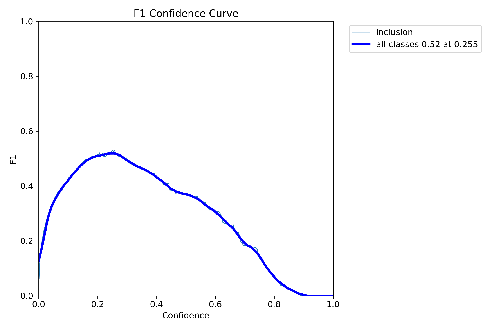

# YOLOv8 Segmentation for Inclusion Detection using NEU-DET Dataset

## Introduction

This project implements a YOLOv8 segmentation model to detect inclusions in images. The dataset used is a subset of the NEU-DET dataset, focusing exclusively on the inclusion defect type. The dataset has been split into three parts: `train`, `val`, and `test`. The inclusion defect data has been processed using the SAM2 model in AnyLabeling for semi-automatic segmentation.


The goal of this project is to build an effective segmentation model that can accurately identify inclusion defects in images.

## Dataset

The NEU-DET dataset contains various defect types, but this project focuses solely on the `inclusion` defect. The dataset was divided into three subsets:

- **Training Set**: Used for training the YOLOv8 segmentation model.
- **Validation Set**: Used for validating the model during training.
- **Test Set**: Used for testing the model's performance after training.

All annotations for the `train` and `val` sets were generated using the SAM2 model in AnyLabeling for semi-automatic segmentation. The annotations are saved in YOLOv8-compatible format, with corresponding JSON and label files.

### Dataset Structure
```
NEU-DET_seg_data/
│
├── train/
│ ├── images/
│ ├── labels/
│ └── annotations/
│
├── val/
│ ├── images/
│ ├── labels/
│ └── annotations/
│
└── test/
├── images/
└── labels/
```

## Conclusion

In this project, I successfully trained a YOLOv8 segmentation model using the `inclusion` subset of the NEU-DET dataset. The dataset was pre-processed using AnyLabeling's SAM2 model for semi-automatic segmentation, resulting in annotations that are compatible with the YOLOv8 segmentation format. The training was performed over 50 epochs using the `yolov8s-seg.pt` model with an image size of 640x640.

Throughout the training process, I observed the model's performance improving steadily, as reflected in the validation metrics. After 50 epochs, the model achieved a precision of **0.53** and a recall of **0.47** for detecting inclusions in the validation set. The trained model was then tested on the unseen test set, and it successfully identified inclusion defects in several images, showcasing its generalization ability.

The results indicate that the YOLOv8 segmentation model can be effectively used to detect inclusion defects in industrial datasets, like NEU-DET, with satisfactory accuracy. Future improvements could involve fine-tuning the model, adding more data, or using more advanced techniques like data augmentation to further enhance performance.

### Results Summary:

* **Number of Epochs** : 50
* **Precision (Validation)** : 0.53
* **Recall (Validation)** : 0.47
* **Test Set Results** : Successful inclusion defect detection on multiple images

Below are some visual results of the segmentation:




